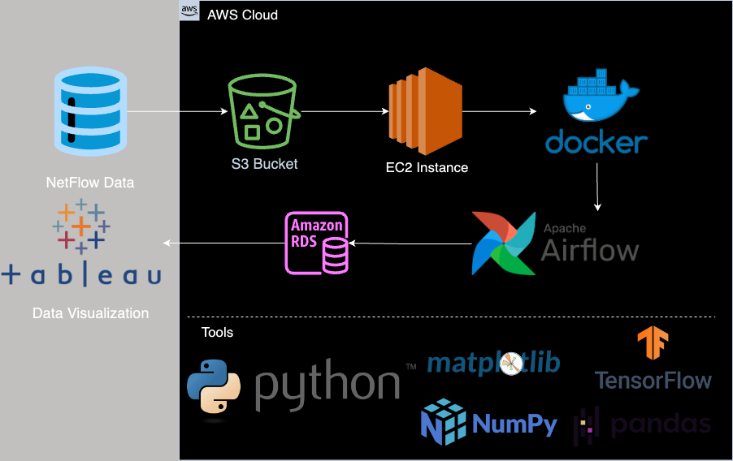
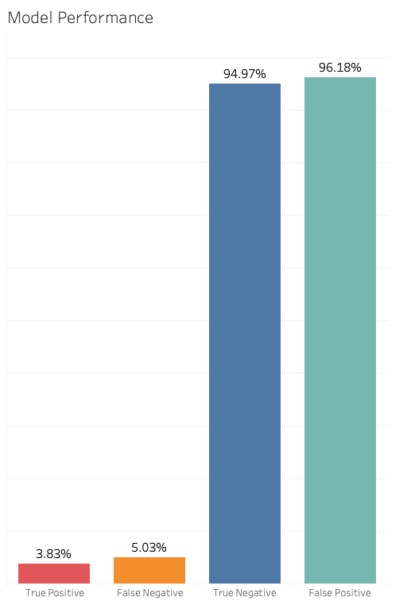

# Authors
- Owen Higgins owenhiggins@vt.edu
- Casey Gary caseygary@vt.edu

# ML Network Intrusion Detection Model

### Description
Using machine learning with Netflow data, to detect anomalous events on a network. Thus proving the feasibility to prevent zero day attacks with Network Intrusion Dection Systems combined with machine learning.
Using a data pipleine with AWS S3, EC2, RDS, Docker, Airflow, Tensorflow and more.

### Objective
Network Intrusion Detection Systems are used to monitor networks for malicious activity and prevent network or data breaches. There is one drawback with these systems; Network Intrusion Detection Systems fail to protect against Zero-Day exploits, which are never before seen attacks used by threat actors. With the vastly growing threat landscape in cyberspace, it is becoming more and more important to be able to protect and defend against these types of attacks. Using machine learning, we plan to be able to detect anomalies on Network Intrusion Detection Systems. A machine learning approach to this issue will allow for rapid and continuous improvement to the model as new threats emerge and are documented. Lastly, we will use Tableau to visualize what attacks we would have been able to prevent using our machine learning model.

### Dataset
This datasets provided by University of Queensland Australia contains NetFlow packet capture data labeled as benign or attack, and includes 12 features and contains around 12 million records. Of these records 77% are benign and 23% are attacks. This dataset was created be used to train machine learning based network intrusion detection systems. The NetFlow format is commonly used on networks which allows for wide deployment and scaling of machine learning based network intrusion detection systems. We chose the NF-UNSW-NB15 dataset for our project. 

Features:
- IPv4 source address
- IPv4 destination address
- IPv4 source port number
- IPv4 destination port number
- IP protocol identifier byte
- Cumulative of all TCP flags
- Layer 7 protocol (numeric)
- Incoming number of bytes
- Outgoing number of bytes
- Incoming number of packets
- Outgoing number of packets
- Flow duration in milliseconds

### 
Dataset - [Machine Learning-Based NIDS Datasets](https://staff.itee.uq.edu.au/marius/NIDS_datasets/#RA5) 

Paper - [NetFlow Datasets for Machine Learning-Based Network Intrusion Detection Systems](https://doi.org/10.1007/978-3-030-72802-1_9)

### Data Quality Assessment

We preformed exploratory data analysis on the dataset that checks for valid data, looks at the shape, checks for nulls, and duplicate values. Since this data comes directly from the University of Queensland, we believe it to be highly trustworthy and accurate.

### Tools & Technologies

- Cloud - [**AWS**](https://aws.amazon.com/)
- Containerization - [**Docker**](https://www.docker.com)
- Orchestration - [**Airflow**](https://airflow.apache.org)
- Data Lake - [**AWS S3**](https://aws.amazon.com/s3/)
- Data Warehouse - [**AWS RDS**](https://aws.amazon.com/rds/)
- Language - [**Python**](https://www.python.org)
- Model Creation - [**Tensorflow**](https://www.tensorflow.org/guide/core/logistic_regression_core)

### Data Pipeline 

We used a ***Batch - ML - Visualize***, data pipeline. Our data is downloaded via an API into the AWS S3 bucket. We use an EC2 instance to handle computation and storage, as well as access our containerization software which is Docker. Inside Docker we are able to store our Python files. We then use Apache Airflow to run our DAG (Directed Acyclic Graph), which is our collection of tasks to preform on the data that is inside of our Python files. The transformed data is prepared for storage in RDS. We can then access and visualize the data through Tableau.

### Data Transformation Models

Minimal data transformation was needed for this dataset as all but two fields were numeric and acceptable for the logistic regression model. The two IP address fields were split into separate columns to remove periods. The data was then split into training and test sets as well as isolating the target variable 'Label'. We used Tensorflow with logistic regression for binary classification as our machine learning model trained on the NetFlow dataset we specifed above. Building of the logistic regression model was adaped from the Tensorflow guide, [**Logistic regression for binary classification**](https://www.tensorflow.org/guide/core/logistic_regression_core). Note: After installing Tensorflow to the Docker container, it is necessary to upgrade the typing-extensions model by running the command "pip install typing-extensions --upgrade". 

### Architecture

### Results
With this project we were able to successfully implement a data pipleline for a simple machine learning classification model for Network Intrusion Detection. This project could serve as a baseline for further training of the existing model, creation of additional classification models, or incorporation of additional datasets to learn from. While the performance of the existing model has much room for improvement, we have built the necessary infrastructure for further training and enhancements which was more important to the project than actual model performance. The project was able to build a reproducable framework to pull in datasets from a highly reputable source, perform EDA as needed, transform the data, store the data for processing, build and train the model to process the data, and build reporting on the model's performance. There is great potential to scale up this framework, for example we have limited the training epochs for our development (configurable by variable) but a larger implementation without processing cost concerns could easily improve performance here. As next steps for this project, we would reccomend configuring re-use of an existing model in a separate dag that could be used for incremental or delta updates to a particular dataset to be run on an existing model and/or for feeding live network traffic data from Netflow. We hope this project proves the viability of using automated data pipeline to train a machine learning model for Network Intrusion purposes.  

### Tableau Visualization of Model Performance

